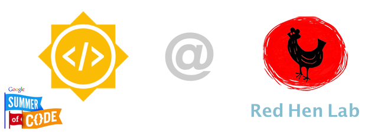

# GSOC 2019
This is the github repo for my [Google Summer of Code 2019](https://summerofcode.withgoogle.com/projects/#5067547718713344) project under [Red Hen Lab](http://www.redhenlab.org/).

## Feature Recognition in Works of Art

- [Project Description](#project-description)
- [Goals](#goals)
- [Tools and Libraries](#tools/libraries)
- [About Me](#about-me)
- [Reference](#reference)

## Project Description
Mentors: [Peter Bell](https://uni-erlangen.academia.edu/PeterBell), [Leonardo Impett](http://www.biblhertz.it/en/institute/staff/staffdatabase/staff-details/ma-leonardo-impett/).

The goal of the project is to build an iconographic feature recognizer. The current methodology as suggested by Leo will be to perform Image Captioning based on [Iconclass](http://iconclass.org) codes. The current testing dataset is provided by [Rijksbureau voor Kunsthistorische Documentatie (RKD)](http://rkd.nl) based on paintings from Biblical scenes from the New Testament. The development will be done on Jupyter Notebooks and then the notebooks will be converted to the expected scripts for the use in the Red Hen HPC pipeline.

## Goals
*Weeks 1 - 4*
- [x] Study the problem well
- [x] Implement GradCAM, GradCAM++
- [x] Scrap the RKD site for the images
- [ ] Start training the CNN based on Iconclass codes  

## Tools/Libraries
1. [unsync]
2. [aiohttp]
3. [aiofiles]
4. [pandas]
5. [fastai]

## About Me
- **Name**: Swagato Chatterjee
- **Email**: swagato.31dec@gmail.com
- **Github**: https://github.com/swagato-c
- **Website**: https://swagtao-c.github.io/

This Readme will be updated weekly so stay tuned!
